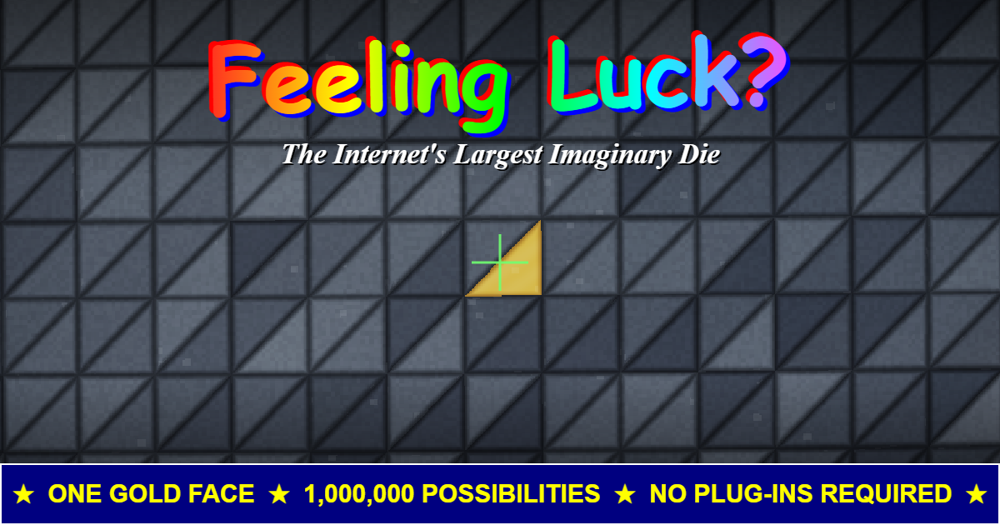
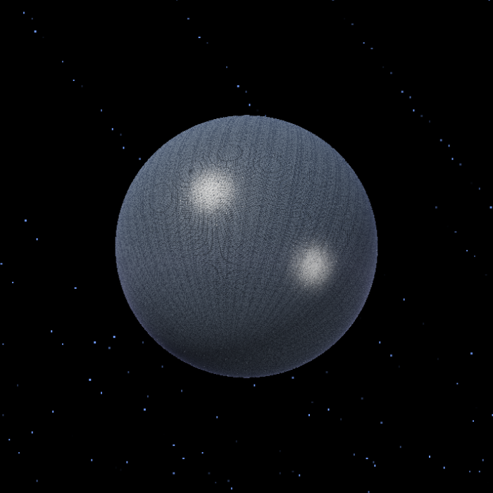
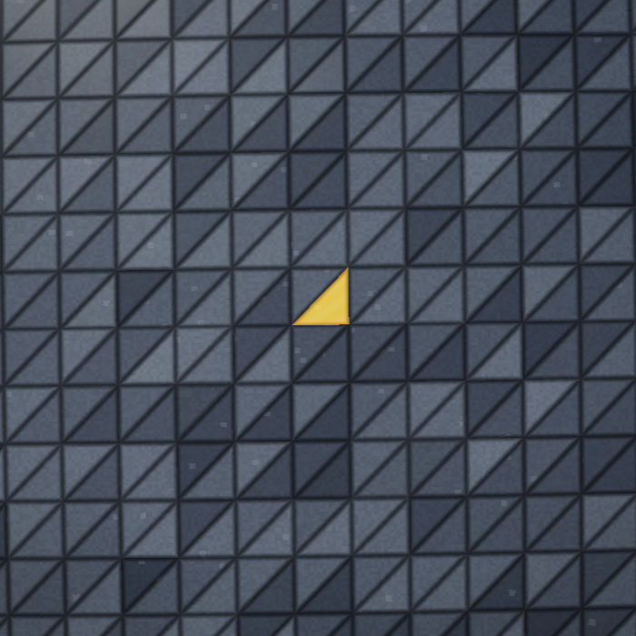

# Feeling Luck? — The D1,000,000

> **One gold face. 1,000,000 possibilities. No plug-ins required.**

A deliberately 1997-flavored, single-file web toy that makes one-in-a-million odds *physical*. Press **YES** and the machine picks one of a million faces with `crypto.getRandomValues()`, then slowly walks your camera from orbit down to human viewing distance — where the "smooth" object resolves into an ocean of triangles, one of which is gold.

## Live demo

**[https://bneidlinger.github.io/feelin_lucky/](https://bneidlinger.github.io/feelin_lucky/)**

## The experience

| From orbit | At human range |
|---|---|
|  |  |

One million addressable triangles, one of them gold. Drag, hold arrow keys / WASD, or use the on-screen pad. Movement is intentionally restrained — the universe does not owe you a convenient search speed.

- **YES** selects one of 1,000,000 face addresses using the browser's cryptographic RNG. If the first random face is gold, that genuinely happened at 1-in-1,000,000 odds for your session.
- **NO** produces a randomized anti-meme error dialog, as required by Internet law.
- A live search-statistics panel estimates how long a complete manual scan would take at your current pace (spoiler: days).
- Center the gold face in the reticle and the win banner fires, with your time and faces-examined stats.

## Zero dependencies, actually

Open `index.html` in any current browser. No server, build step, external library, image asset, or network connection is required at runtime.

The renderer does **not** allocate a million DOM nodes or mesh objects. A single full-screen fragment shader ray-traces the sphere and procedurally addresses exactly 1,000,000 triangular surface regions (a 1000×500 lat/long grid, two triangles per cell). WebGL2 is preferred, with a WebGL1 + `OES_standard_derivatives` fallback for vintage kiosk hardware.

## Testing options

| URL parameter | Effect |
|---|---|
| `?demo=1` | The initial approach lands within a few dozen faces of the gold one |
| `?gold=123456` | Forces zero-based internal gold-face ID `123456` |

A small diagnostic surface is exposed at `window.__millionDie` (`getState()`, `beginApproach()`, face/direction converters) for automated testing.

## Deploying to GitHub Pages

1. Push this repo to GitHub.
2. **Settings → Pages → Source:** deploy from branch `main`, folder `/ (root)`.

## License

[MIT](LICENSE). The gold face's feelings remain the property of the gold face.
